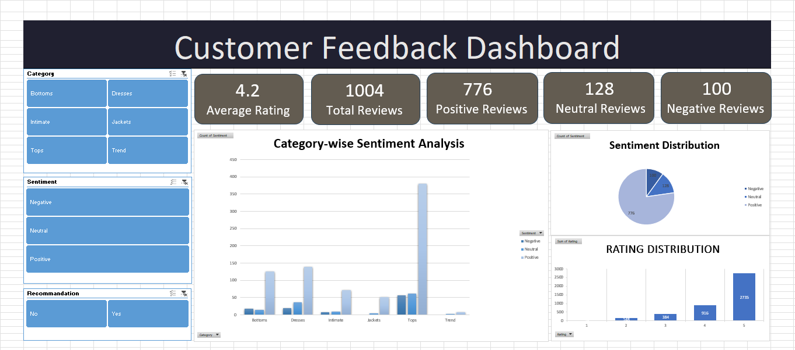

# Customer Feedback Analysis Dashboard (Excel)

## 📌 Objective

The goal of this project is to analyze customer feedback data to understand sentiment, identify common issues, and evaluate overall customer satisfaction.

---

## 📊 Dataset

* Source: Kaggle (Women's E-Commerce Clothing Reviews)
* Size: ~1000 selected records (from a larger dataset)
* Data includes:

  * Customer Age
  * Review Text
  * Rating (1–5)
  * Recommendation (Yes/No)
  * Product Category & Subcategory

---

## 🧹 Data Cleaning & Preparation

* Removed unnecessary columns and index data
* Handled missing values (filtered out blank reviews)
* Standardized column names for clarity
* Converted recommendation values (0/1 → Yes/No)
* Cleaned review text using TRIM function

---

## 🧠 Feature Engineering

* Created **Sentiment column** based on ratings:

  * Positive (≥4), Neutral (3), Negative (≤2)
* Extracted keyword-based features using Excel formulas:

  * Size Issues
  * Fit Issues
  * Bad/Negative Feedback indicators

---

## 📈 Analysis Performed

* Sentiment distribution across all reviews
* Category-wise sentiment comparison
* Rating distribution analysis
* Recommendation vs Sentiment relationship
* Keyword-based issue analysis (size, fit, quality)

---

## 📊 Dashboard Features

* KPI Cards:

  * Total Reviews
  * Positive Reviews
  * Negative Reviews
  * Average Rating
* Visualizations:

  * Sentiment Distribution (Pie Chart)
  * Category-wise Sentiment (Clustered Bar Chart)
  * Rating Distribution (Column Chart)

* Interactive slicers:

  * Category
  * Sentiment
  * Recommendation

---

## 🧠 Key Insights

* Majority of customer feedback is positive, indicating overall satisfaction
* Certain product categories show higher negative sentiment
* Strong correlation between positive sentiment and product recommendation
* Common issues identified include size and fit concerns

---

## 📷 Dashboard Preview

---

## 🛠 Tools Used

* Microsoft Excel
* Pivot Tables
* Excel Formulas (IF, SEARCH, TRIM)
* Data Visualization & Dashboard Design

---

## 🚀 Project Outcome

This project demonstrates the ability to clean real-world data, perform sentiment-based analysis, extract insights from textual feedback, and present findings through an interactive dashboard.

